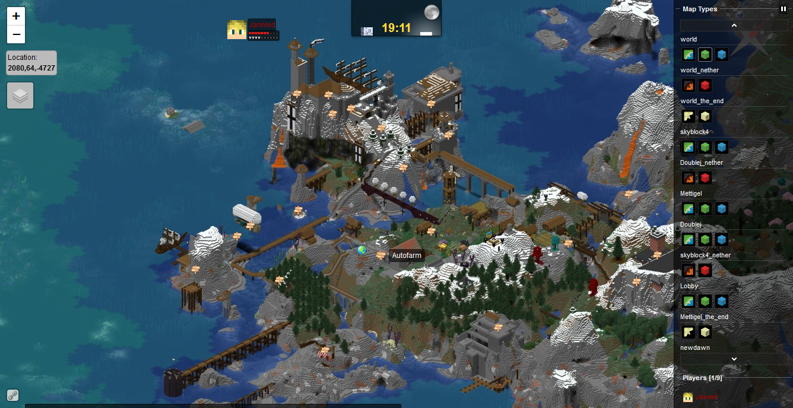

# Dynmap-Multiverse Bridge

This add-on for [Dynmap](https://github.com/webbukkit/dynmap) will visualize the position of [Multiverse](https://github.com/Multiverse/Multiverse-Core) Anchors.

## Installation
The plugin has been tested with PaperMC but should also work with plain Spigot.

1. Install the latest version of Dynmap ([Modrinth](https://modrinth.com/plugin/dynmap/versions?l=paper&l=spigot) / [SpigotMC](https://www.spigotmc.org/resources/dynmap%C2%AE.274/))
2. Install at least Multiverse-Core ([Modrinth](https://modrinth.com/plugin/multiverse-core) / [SpigotMC](https://www.spigotmc.org/resources/multiverse-core.390/))
3. Download the latest `Dynmap-Multiverse-1.?.jar` file from the [releases page](https://github.com/Jannled/Dynmap-Multiverse/releases) and put it in the plugin folder of your server.
3. After restarting your server, you should see a sign icon  at every anchor position you have created.

## Development
This is just a quick prototype I threw together using VS Code and Maven (because I didn't wanna install IntelliJ for a one off project).

If you are missing a feature in this plugin our found a bug, feel free to open an [issue](https://github.com/Jannled/Dynmap-Multiverse/issues).

### Known Issues
- New or deleted anchors will only show up after a plugin reload, since I haven't found an event handler that will fire when an anchor is created/modified.
